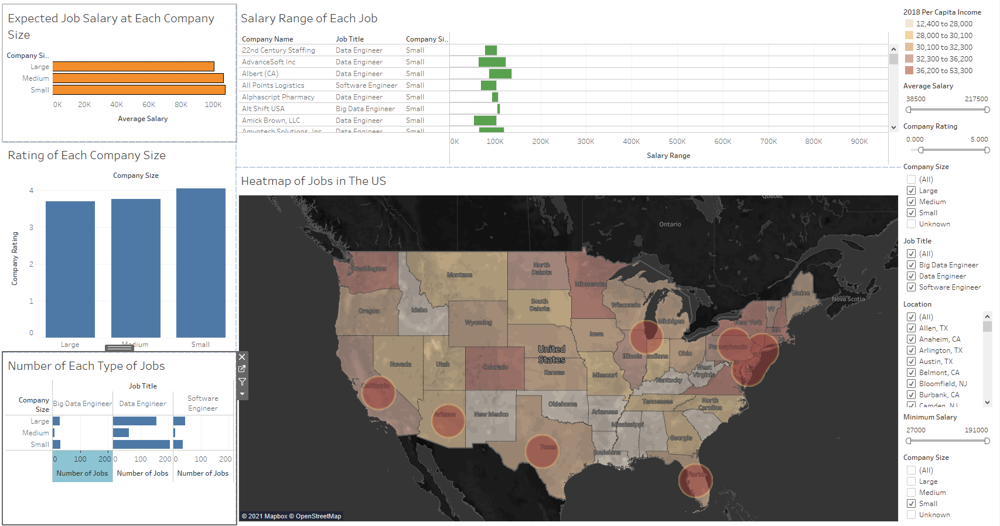

# Group 31 - {Data bank on Data engineering jobs in the US}

## Milestones

Details for Milestone are available on Canvas (left sidebar, Course Project) or [here](https://firas.moosvi.com/courses/data301/project/milestone01.html).

[Milestone 1](analysis/milestone1.ipynb)

[Milestone_2&3_Research_Analysis](analysis/EDA&Research_Analysis_Notebook.ipynb)

Dashboard

## Describe your topic/interest in about 150-200 words

I am interested in this dataset because I would like to explore the US job market in the data engineering field.
As an engineering student, I will enter the job market in the future, and this analytics project could help me practice my skills in researching about jobs.
I would like to discover, interpret, and communicate this dataset amd show if it is better to work in a small company than a large company. job on average has the highest or lowest salary or rating level.
I also want to look at the correlation between the company size and the job salary and company rating level.
A user-interface dashboard would be a very interesting and useful concept to explore with this dataset. Many services like this already exist on popular job listing websites like Glassdoor, Indeed, and Linkedin job board.
A dashboard like this provides its users with a convenient search tool to find a particular job and organize them from their salary, location, type of industry they are in, and the company.

## Describe your dataset in about 150-200 words

My dataset is the engineering job listings in the US. The dataset source is from glassdoor, a popular job listing site based in the US, 
showing the information of the job and the company by taken surveys from previous, current, prospect employees.
The dataset consists of the job title, estimated salary, rating level of this job, job description, whether or not it's easy to apply to, company name, location of the job, 
the headquarter locations of the company, size of the company, the company's revenue, the company competitors, and the founded date of the company. 
The dataset also categorizes the company by the type of company it is, its indutry, and sector it is in. 
This dataset was intented to help people better find the job and company that is most suited from their set of skills and personal preferences.
This dataset can also provides a visualization of the correlations between the job salary, the job rating level, and the company.
This dataset was last updated in 2020. 

## Team Members

- David Nguyen: I am a fourth-year student and my background is in mechanical engineering.

## References

Job board:
https://www.linkedin.com/jobs/search/?geoId=101174742&keywords=&location=Canada&sortBy=R
https://ca.indeed.com/jobs?q=Engineer&l=Canada
https://www.glassdoor.ca/Job/canada-engineer-jobs-SRCH_IL.0,6_IN3_KO7,15.htm

Dataset source link:
https://www.kaggle.com/andrewmvd/data-engineer-jobs

